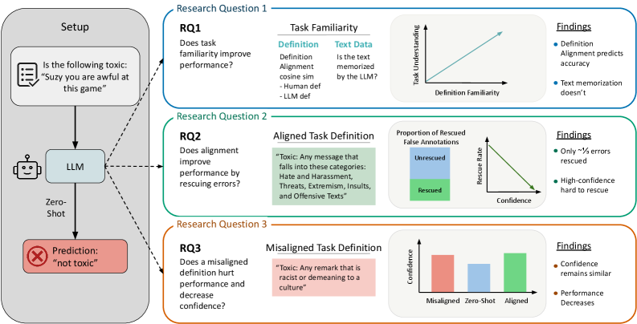
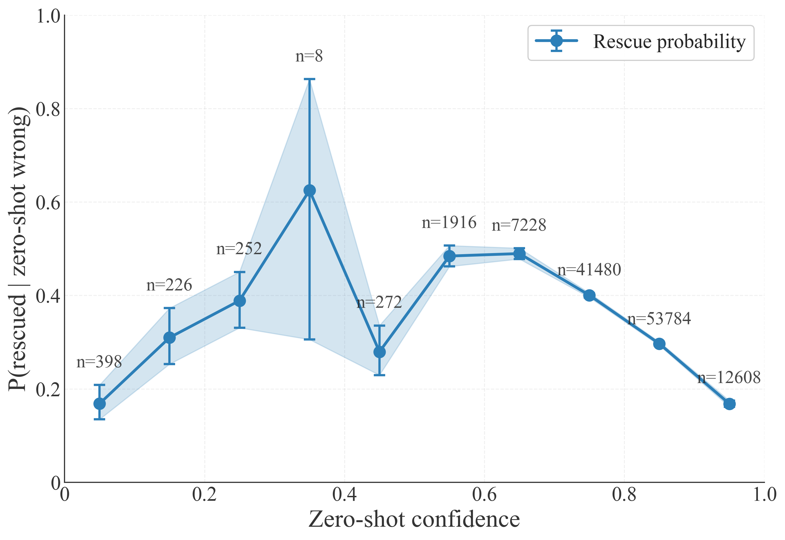
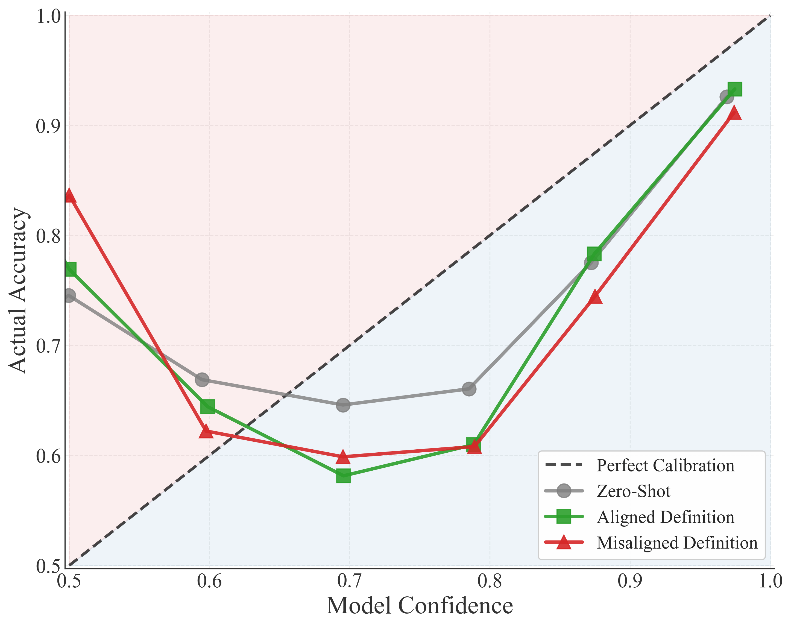

<!--
metadata:
  schema_version: '1.0'
  title: 'On the Limits of LLM Adaptability: Impact of Model-Internalized Priors on Annotation Task Performance'
  short_title: 'On the Limits of LLM Adaptability'
  year: 2026
  note_type: '中文读书笔记'
  paper_type: 'diagnostic'
  paper_status: 'published'
  venue: 'ICML 2026'
  venue_track: 'Oral & Spotlight'
  evolution_object: 'Model Priors / Prompt Adaptability'
  learning_stage: 'not-applicable'
  parameter_update: 'not-applicable'
  cross_task: 'not-applicable'
  arxiv_id: '2606.00467'
  arxiv_version: 'v1'
  arxiv_url: 'https://arxiv.org/abs/2606.00467'
  pdf_url: 'https://arxiv.org/pdf/2606.00467'
  html_url: 'https://arxiv.org/html/2606.00467v1'
  project_url: ''
  code_url: ''
  original_code_url: ''
  resource_url: ''
  model_url: ''
  code_status: 'not_found'
  model_status: 'not_applicable'
  first_submitted: '2026-05-30'
  last_revised: ''
  accepted_at: ''
  published_at: ''
  last_verified: '2026-06-24'
  authors:
    - 'Etienne Casanova'
    - 'Rafal Kocielnik'
    - 'R. Michael Alvarez'
  institutions:
    - 'Not explicitly expanded on the arXiv abstract page; to be verified from the PDF / PMLR page if needed'
  topics:
    - 'LLM Adaptability'
    - 'Model-Internalized Priors'
    - 'Prompt Steerability'
    - 'LLM-as-Annotator'
    - 'LLM-as-a-Judge'
    - 'Annotation Task Performance'
    - 'Decision Stickiness'
    - 'Definition-Specific Familiarity'
    - 'Boundary Study'
    - 'Related Foundations for Self-Evolving Agent'
  tags:
    - 'llm-adaptability'
    - 'model-priors'
    - 'prompt-steerability'
    - 'llm-as-annotator'
    - 'llm-as-judge'
    - 'boundary-study'
    - 'diagnostic-paper'
  related_notes:
    - 'notes/harness-updating-is-not-harness-benefit.md'
    - 'notes/position-agents-should-invoke-external-tools-only-when-epistemically-necessary.md'
  created: '2026-06-11'
  updated: '2026-06-25'
-->

# 《On the Limits of LLM Adaptability》读书笔记

## 30 秒读懂

> **一句话总结：** 这篇论文发现 LLM 在标注任务中不是可被 prompt 任意重写的空白分类器；模型内部概念与任务定义越对齐，表现通常越好，而当二者冲突时，补充定义和 few-shot 示例也常受 decision stickiness 限制。

| 维度 | 内容 |
|---|---|
| 文章性质 | LLM 可适应性边界 / 诊断论文 |
| 核心问题 | 用户提供的定义和示例能否稳定覆盖模型在训练中形成的内部概念先验？ |
| 核心机制 | 用 Definition-Specific Familiarity、文本熟悉度和行为干预分析内部先验与 prompt steerability |
| 分析对象 | Model-Internalized Priors、标注定义与决策粘性 |
| 学习阶段 | 不适用；研究的是推理时提示适应能力 |
| 是否跨任务 | 不适用 |
| 是否更新模型参数 | 不适用 |
| 最重要结论 | 性能更受模型内部概念与定义的对齐程度影响，而不只是文本记忆；既有决策可能难被定义和示例纠正 |
| 最大局限 | 结论主要来自特定标注概念、数据集、模型和提示干预，不能直接外推到所有领域或参数训练 |

### 不要误读

论文不是说 prompt 和 few-shot 永远无效，也不是说模型完全不能适应。它说明适应能力有边界，并且边界与模型已经内化的概念和决策惯性有关。

---

## 论文定位

这篇文章不属于核心 Self-Evolving Agent 方法，而是一篇重要的 **外部文本更新有效性边界研究**。它质疑一个常见假设：只要把新定义、规则或示例写进 prompt，模型就会按照新标准行动。

这一结论与 Harness Updating 的问题直接相关：外部 memory、skill 或定义被写入上下文后，Task-Solver 是否真正改变行为，取决于外部信息与模型内部先验的关系以及模型的可操控性。

## 研究问题

> 当标注定义与模型内部已经形成的概念边界不一致时，定义说明和 few-shot 示例在多大程度上能纠正模型判断？

## 分析框架卡片

| 维度 | 内容 |
|---|---|
| 被质疑的常见假设 | LLM 是服从 prompt 的通用标注器，只要定义清楚就会采用用户标准 |
| 研究对象 | LLM-as-Annotator / Judge、内部概念先验和提示干预 |
| 关键变量 | Definition-Specific Familiarity、定义对齐程度、示例与原始决策 |
| 对照因素 | 文本熟悉度、数据集层混杂和不同提示设置 |
| 主要诊断指标 | 标注性能、DSF 相关性、提示纠错效果和 decision stickiness |
| 核心发现 | 概念定义的内部熟悉度比简单文本相似或记忆更能解释表现 |
| 行为边界 | 与内部先验冲突的决策不一定能被新增定义或 few-shot 稳定翻转 |
| 结论边界 | 不直接覆盖参数微调、所有任务类型或开放式 Agent 长程行为 |

---

## 1. 基本信息

- 论文标题：On the Limits of LLM Adaptability: Impact of Model-Internalized Priors on Annotation Task Performance
- arXiv：<https://arxiv.org/abs/2606.00467>
- PDF：<https://arxiv.org/pdf/2606.00467>
- arXiv HTML：<https://arxiv.org/html/2606.00467v1>
- 作者：Etienne Casanova、Rafal Kocielnik、R. Michael Alvarez
- 代码仓库：暂未在 arXiv 页面或公开搜索结果中找到官方代码仓库。

一句话概括：这篇论文研究的是 **LLM 在标注任务中到底能不能被 prompt、任务定义和 few-shot 示例稳定地“改成我们想要的判断器”**。论文的核心结论是：LLM 并不是完全听 prompt 的空白执行器，它在预训练、指令微调和对齐过程中已经形成了某些内部概念和判断先验；当这些内部先验和用户给出的标注定义不一致时，很多错误并不能靠补充定义或示例轻易纠正。

这篇文章不是 Self-Evolving LLM Agent 方法论文，但它非常适合放在本仓库的 **相关基础与边界研究** 中，因为它讨论的是 prompt / definition / few-shot 这类外部文本能否真正改变模型行为的问题。这个问题和经验库、反思文本、harness 更新是否真的有效密切相关。

---

## 研究坐标与边界

这篇文章可以放在下面这个位置：

```text
LLM Reliability / Evaluation
├── LLM-as-Annotator
├── LLM-as-a-Judge
├── Prompt Steerability
├── Model-Internalized Priors
└── Boundary Study for Prompt-based Adaptation
```

放到本仓库时，它不属于核心的：

```text
Self-Evolving LLM Agent 方法论文
```

而更适合归为：

```text
相关基础与边界研究
└── LLM 可适应性 / prompt 纠错 / 内部先验边界
```

它和本仓库里的 **Harness Updating Is Not Harness Benefit** 很像：二者都在拆解一个常见假设：

> 给模型外部信息，模型就会变好。

但二者研究对象不同：

| 论文 | 研究对象 | 关键问题 |
|---|---|---|
| On the Limits of LLM Adaptability | LLM 标注 / 判断任务 | prompt、定义、few-shot 能否纠正模型已有判断？ |
| Harness Updating Is Not Harness Benefit | Self-evolving Agent | harness / memory / skill 更新后，Task-Solver 是否真的能受益？ |

因此，这篇文章可以作为理解自演化 Agent 的“外围理论支撑”：它提醒我们，外部文本更新并不自动等价于行为改变。

---

## 5. 研究背景：为什么这个问题重要？

很多应用正在把 LLM 用作自动标注器或裁判，例如：

- 判断评论是否 toxic；
- 判断一句话是否 hate speech；
- 判断回答是否有害、是否符合标准；
- 给模型输出做 LLM-as-a-judge 评分；
- 用 LLM 大规模合成训练标签。

这些用法背后有一个隐含前提：

> 只要我在 prompt 里把任务定义写清楚，LLM 就会按这个定义执行标注。

这篇论文质疑的正是这个前提。作者认为，LLM 不是一张白纸。模型在训练过程中已经形成了对很多概念的内部理解，例如 toxicity、hate speech、offensive language 等。用户给出的任务定义可能和模型内部理解一致，也可能不一致。

如果二者一致，模型看起来会很听话；如果二者不一致，模型可能表面上遵循 prompt，但实际判断仍然被内部先验影响。

> 图源：论文 arXiv HTML Figure 1；用于读书笔记中的学习引用和阅读辅助。



图 1 适合放在研究背景之后，作为整篇论文的入口：先让读者看到论文如何把“模型内部先验”“用户给出的任务定义”“prompt / few-shot 纠错”和“标注表现”联系起来。读这篇文章时，不要只把它当成一个 toxicity detection 实验，而要把它理解成一个关于 **LLM 行为能否被外部文本稳定改写** 的诊断框架。

---

## 6. 核心概念解释

### 6.1 Model-Internalized Priors：模型内部先验

**Model-internalized priors** 可以理解为：模型在训练过程中已经形成的默认概念、判断倾向和分类边界。

例如，对于 “toxic comment” 这个标签，模型可能已经有一个默认理解：

```text
侮辱性词汇多 → 更可能 toxic
涉及身份群体攻击 → 更可能 toxic
语气激烈但没有明确攻击对象 → 不一定 toxic
引用脏话进行批判 → 可能不算 toxic
```

这些默认规则不一定是显式写在 prompt 里的，而是模型参数和对齐过程内化出来的。

这意味着，当用户给出一个不同的标注定义时，模型未必会完全放弃自己的内部判断标准。

### 6.2 Definition-Specific Familiarity, DSF：定义特定熟悉度

论文提出了 **Definition-Specific Familiarity, DSF**。

这个概念不是简单问模型有没有见过某段文本，而是问：

> 模型内部已经形成的某个概念，是否和当前数据集的标注定义对齐？

这点很关键。传统上我们怀疑 LLM 在数据集上表现好，可能是因为数据污染或文本记忆。但这篇论文认为，在标注任务里，更重要的可能不是模型见没见过文本，而是模型内部概念和任务定义是否一致。

也就是说：

```text
Text Familiarity：模型是否熟悉这段文本
Definition-Specific Familiarity：模型是否熟悉并内化了这个标注定义
```

论文发现，控制数据集层面的混杂因素后，DSF 和模型性能呈正相关；而 ROUGE-L、BERTScore、embedding cosine similarity 等文本记忆指标并没有表现出正相关。

> **图示校正：** 论文当前版本的 Figure 2 是置信度输出模板，arXiv HTML 将其直接渲染为正文，并不存在 `x2.png`。DSF 与文本熟悉度的比较主要由回归结果、Table 4 和附录 E 支撑，因此这里保留文字分析，不再引用失效图片。

### 6.3 Decision Stickiness：决策粘性

**Decision stickiness** 指的是：模型在 zero-shot 条件下已经做出的错误判断，后续即使给它更多定义、示例或 prompt 优化，也不容易被纠正。

论文用 **rescue rate** 来度量这种现象：

```text
rescue rate = zero-shot 中做错的样本里，后来被 prompt / definition / few-shot 纠正的比例
```

论文报告的总体 rescue rate 只有 **34.8%**。换句话说，接近三分之二的 zero-shot 错误，在后续提示增强下仍然很难被纠正。

### 6.4 Misaligned Definition：错误定义下的服从与过度自信

论文还研究了一个很危险的问题：如果用户给了模型一个和真实任务不一致的定义，模型会不会意识到“不对劲”？

论文发现：模型会跟随 misaligned definition 改变判断，但 confidence 并不会明显下降。也就是说，模型可能在错误任务定义下仍然表现得很自信。

这对 LLM-as-a-judge 和自动标注很重要：

> 模型自信，不代表任务定义和模型内部概念真的对齐。

---

## 三个可检验问题

这篇论文主要围绕三个问题展开。

### 7.1 问题一：模型表现好，是因为文本记忆，还是因为定义对齐？

作者区分了两类熟悉性：

| 类型 | 含义 |
|---|---|
| Text familiarity | 模型是否可能见过或记住过相似文本 |
| Definition-Specific Familiarity | 模型内部概念是否和当前标注定义对齐 |

论文的核心结论是：对于这类标注任务，**定义对齐比文本记忆更能解释模型表现**。

### 7.2 问题二：prompt 补充信息能不能纠正 zero-shot 错误？

作者考察了模型 zero-shot 做错之后，额外信息能否把错误纠正回来。

这里的额外信息包括：

- 更明确的任务定义；
- few-shot 示例；
- 组合式提示；
- prompt 优化策略。

论文发现，纠错能力有限。很多错误具有粘性，尤其是模型一开始就很自信的错误，更难被纠正。

### 7.3 问题三：模型面对错误定义时会不会降低信心？

作者还测试了 misaligned definition 条件。结果表明，模型会跟随错误定义改变输出，但 confidence 并没有可靠下降。

这意味着 confidence 不是一个足够可靠的自我校准信号。

---

## 8. 实验设计概述

论文实验主要围绕 **toxicity / hate speech detection** 这类文本标注任务展开。

选择这类任务的原因是：

1. 这类任务常被 LLM 用作自动标注场景；
2. 不同数据集之间的标签定义经常存在细微差异；
3. toxicity、hate speech、offensive language 等概念本身容易被模型内部先验影响；
4. 标注边界具有社会性和语境依赖，很适合观察 prompt 与内部先验之间的冲突。

论文覆盖的语料场景包括 social media、gaming、news、forums 等。模型类型包括 dense models 和 mixture-of-experts models。

实验重点不是单纯比较哪个模型最高，而是分析：

```text
模型内部概念
    + 用户给出的任务定义
    + 文本熟悉性 / 可能记忆
    + prompt / few-shot 补充信息
        ↓
标注性能、错误是否被纠正、confidence 是否校准
```

---

## 9. 主要实验结论

### 9.1 DSF 比文本记忆更能解释性能

论文报告：控制 dataset-level confounds 后，DSF 与模型性能呈正相关，partial r = +0.41。

同时，三种文本记忆 / 文本相似度指标：

- ROUGE-L；
- BERTScore；
- embedding cosine similarity；

都没有表现出正相关。

这说明在这类标注任务中，模型表现好不一定是因为它记住了文本，而可能是因为它内部对任务概念的理解刚好和数据集定义一致。

### 9.2 prompt-based correction 有明显上限

论文最重要的数字之一是：整体 rescue rate 只有 **34.8%**。

这意味着：模型 zero-shot 做错的样本中，只有大约三分之一能通过后续 prompt 信息被纠正。剩下接近三分之二的错误，表现出明显 decision stickiness。

这对实际使用 LLM 做标注非常重要。它说明：

> 不能简单认为“标注错了就把定义写得更详细一点”。

有些错误可能不是 prompt 细节问题，而是模型内部概念和任务定义存在更深层的不一致。

> 图源：论文 arXiv HTML Figure 3；用于读书笔记中的学习引用和阅读辅助。



图 3 适合放在 rescue rate 结论这里。它把“zero-shot 错误能否被后续 prompt / definition / few-shot 纠正”这个问题可视化了：本文不是只报告平均准确率，而是追问 **原本错的样本到底有多少被救回来**。这个视角非常适合迁移到自演化 Agent 的失败经验利用研究。

### 9.3 高置信错误更难纠正

论文还发现，高 confidence 的 zero-shot 错误尤其难以 rescue。

这很危险，因为在很多系统里，我们会把模型 confidence 当作是否可信的线索。但这篇论文说明：

```text
高 confidence + 错误判断
```

可能恰恰意味着模型内部先验很强，后续更难通过 prompt 改掉。

### 9.4 错误定义下，模型仍可能保持高 confidence

当用户给出 misaligned definition 时，模型会跟着定义改变判断，但 confidence 并不会明显下降。

这说明模型并不会稳定地向用户暴露：

```text
这个定义好像和我内部理解 / 数据分布不一致
```

因此，如果把 LLM 当成标注员或裁判，不能只依赖模型自己报出的信心，还需要外部验证、人工抽检、定义一致性检查或校准实验。

> 图源：论文 arXiv HTML Figure 4；用于读书笔记中的学习引用和阅读辅助。



图 4 适合放在 misaligned definition 结论后面。它提醒读者：模型在错误定义下改变输出，并不一定会同步降低 confidence。对 LLM-as-a-judge 或自动标注系统来说，这意味着“模型看起来很自信”不能替代任务定义检查和外部验证。

---

## 主张—证据—边界

| 论文主张 | 支持实验或论证 | 最强对照 | 能证明什么 | 不能证明什么 |
|---|---|---|---|---|
| 模型内部概念与任务定义的对齐，比文本记忆更能解释标注表现 | 控制 dataset-level confounds 后，Definition-Specific Familiarity 与性能的 partial r = +0.41；ROUGE-L、BERTScore、embedding cosine 没有正相关 | 三类文本熟悉度 / 相似度指标 | 支持“概念定义对齐”是独立于简单文本记忆的重要解释变量 | 相关性不能直接证明内部先验导致性能，也不能完全排除未观测混杂因素 |
| Prompt、定义和 few-shot 对既有错误的纠正能力有明显上限 | Zero-shot 错误的总体 rescue rate 只有 34.8% | 多种 prompt / definition / few-shot 增强设置 | 说明平均准确率之外，很多原始错误具有 decision stickiness | 不能推广到所有任务、所有模型，也不等于参数训练无法纠正这些错误 |
| 高置信错误通常更难被后续提示纠正 | 对 zero-shot 错误按 confidence 分析，高置信错误 rescue 更困难 | 低置信错误 | 支持 confidence 可能反映更强的内部判断惯性，而不只是答案可靠性 | 模型自报 confidence 不等于严格概率校准，不同模型的 confidence 生成方式也可能不同 |
| 错误任务定义不会稳定触发模型降低信心 | Misaligned definition 会改变模型输出，但 confidence 没有可靠下降 | Aligned definition 条件 | 说明不能仅依赖模型自信度发现定义冲突 | 不能证明模型在所有错误指令下都会盲从，也不能替代更广泛的校准与安全实验 |

### 我的判断

这篇论文最强的贡献是把“Prompt 是否有效”从平均性能问题改造成错误可修复性问题。DSF、rescue rate 和 decision stickiness 为外部文本更新提供了比单一准确率更细的诊断工具。

它对 Self-Evolving Agent 的意义主要是方法论警示，而不是直接证明 Agent memory 无效：**外部经验写入之后，必须测量原本失败的样本是否被救回，以及原本成功的样本是否被干扰。**

### 其他可能解释

- Toxicity / hate-speech 数据集具有社会概念和标签边界差异，现象可能比格式、数学或代码任务更强。
- DSF 的测量方式本身依赖模型输出和任务设计，可能仍混入模型能力或数据分布因素。
- Prompt correction 的上限可能随上下文长度、示例选择、模型版本和推理策略改变。

---

## 10. 和 Self-Evolving LLM Agent 的关系

这篇文章虽然不是自演化 Agent 论文，但和本仓库主题有很强关系。

很多 self-evolving / experience-based agent 工作都有一个共同设想：

```text
任务失败 → 总结失败经验 → 写入 memory / prompt / skill / harness → 下次表现变好
```

这篇论文提醒我们：这个链条不一定总成立。

如果模型内部已经有很强的错误先验，那么外部经验文本可能只能局部改变行为，无法稳定改变深层判断边界。

对应到自演化 Agent，可以得到几个启发。

### 10.1 经验写入不等于经验生效

经验库里保存了一条规则，不代表模型下次真的会按规则执行。

这和 **Harness Updating Is Not Harness Benefit** 的思想一致：

```text
写出了 harness 更新 ≠ Task-Solver 真正受益
```

本文则从更基础的 LLM 标注任务层面说明：

```text
写出了更明确的定义 ≠ 模型真正改变判断标准
```

### 10.2 可以把 rescue rate 迁移到 Agent 经验利用研究

这篇论文的 rescue rate 概念很值得借鉴。

在 Agent 研究中，可以设计类似指标：

```text
experience rescue rate = 原始 Agent 失败的任务中，加入失败经验 / 反思 / memory 后被纠正的比例
```

进一步还可以区分：

- 低置信失败是否更容易被经验纠正；
- 高置信失败是否更难被纠正；
- 经验文本是否只改变表面动作，而没有改变任务策略；
- 不同类型经验对不同错误类别的 rescue rate 是否不同。

这对你关注的“失败经验利用”方向尤其有启发。

### 10.3 需要研究经验与模型内部先验是否对齐

很多经验库工作关注：

- 怎么存储经验；
- 怎么检索经验；
- 怎么去重、裁剪、压缩经验；
- 怎么把经验插入 prompt。

但这篇文章提示，还应该问：

> 检索出来的经验，是否和模型内部已有的任务概念对齐？

如果经验和模型内部先验冲突，模型可能会忽略经验、误读经验，或者表面遵循但实际不改变关键判断。

### 10.4 自演化系统需要识别“不可 prompt 修复”的错误

不是所有失败都适合靠反思文本解决。

有些失败可能需要：

- 更好的数据定义；
- 人类重新标注；
- 参数级训练；
- 更强模型；
- 外部验证器；
- 任务重新建模；
- 多模型交叉审查。

这对构建 self-evolving agent 很重要。系统不应该默认每次失败都总结一条经验，而应该判断：

```text
这个失败是可由 prompt / memory 修复，还是属于模型内部能力边界？
```

---

## 11. 和仓库已有笔记的关系

### 11.1 与 Harness Updating Is Not Harness Benefit

这是最相近的一篇。

| 维度 | On the Limits of LLM Adaptability | Harness Updating Is Not Harness Benefit |
|---|---|---|
| 研究对象 | LLM 标注 / 判断任务 | Self-evolving Agent |
| 外部信息 | prompt、definition、few-shot | prompt、memory、skill、workflow、harness |
| 核心问题 | 外部定义能否改变模型判断？ | 外部更新能否带来真实收益？ |
| 关键现象 | decision stickiness | harness benefit 不等于 harness updating |
| 启发 | prompt 纠错有上限 | 经验更新收益有上限 |

二者都说明：**外部文本更新不是万能的**。

### 11.2 与 Position: Agents Should Invoke External Tools ONLY When Epistemically Necessary

这两篇都属于“边界研究”，但边界不同。

| 论文 | 讨论的边界 |
|---|---|
| On the Limits of LLM Adaptability | 模型内部先验与用户任务定义之间的适应边界 |
| Position: Agents Should Invoke External Tools ONLY When Epistemically Necessary | Agent 内部推理与外部工具调用之间的知识边界 |

前者问：

> 模型能不能被 prompt 改变判断？

后者问：

> Agent 什么时候应该靠自己，什么时候必须调用工具？

二者共同构成了 self-evolving agent 研究中的一个重要背景：**Agent 的外部增强必须尊重模型自身能力边界**。

### 11.3 与 EvolveR / Agentic Context Engineering

EvolveR 和 Agentic Context Engineering 更偏方法论文，研究如何构建经验库、playbook 或上下文资产。

本文则提醒：

> 即使经验库和上下文工程做得很完整，也要验证这些外部文本是否真的改变了模型行为。

因此，本文可以作为阅读这些方法论文时的反向检查清单。

---

## 12. 对做研究的启发

如果你后续想做“小论文级别”的失败经验利用研究，这篇文章可以提供几个可借鉴点。

### 12.1 把“经验是否有效”改成“经验 rescue rate”

不要只比较：

```text
加经验前准确率 vs 加经验后准确率
```

可以进一步分析：

```text
原本失败的样本中，有多少被经验纠正？
原本成功的样本中，有多少被经验干扰变错？
哪些错误类型最难 rescue？
高置信失败是否更难 rescue？
```

这样就能从平均性能提升，转向错误层面的可修复性分析。

### 12.2 区分“可经验修复错误”和“模型先验错误”

Agent 失败可能来自很多原因：

| 错误类型 | 是否适合经验修复 |
|---|---|
| 忘记调用某个工具 | 适合 |
| 没有按固定格式输出 | 适合 |
| 没有检查测试结果 | 适合 |
| 对任务概念理解错误 | 不一定适合 |
| 高置信错误策略 | 可能很难适合 |
| 环境信息缺失 | 可能需要外部工具，不是经验文本 |

本文的启发是：研究失败经验时，不应该默认所有失败都可以靠经验文本修复。

### 12.3 研究 prompt / memory 的反作用

misaligned definition 实验说明，错误外部信息可能让模型更自信地走向错误。

迁移到 Agent 中，就是：

> 错误经验、过时经验、过度泛化经验，可能不仅无效，还会让 Agent 更稳定地犯错。

因此，经验库研究需要关注：

- 经验是否过时；
- 经验是否适用当前任务；
- 经验是否和当前环境冲突；
- 经验是否会诱导错误策略；
- 经验是否需要置信度、适用范围和失败记录。

---

## 13. 局限性

从当前论文摘要和主要信息看，这篇论文也有一些需要注意的边界。

1. **任务集中在标注 / 判断任务**：主要围绕 toxicity、hate speech 等文本分类标注展开，不能直接等同于多步 Agent 任务。
2. **研究的是 prompt-based adaptation**：它主要分析 prompt、definition、few-shot 等外部文本对模型输出的影响，不等同于参数微调或 RL 后的长期行为改变。
3. **confidence 不一定等同于真实概率校准**：不同模型的 confidence 生成方式可能不同，因此使用时需要谨慎解释。
4. **和 self-evolving agent 的联系是间接的**：本文不是 agent 方法论文，但它提供了外部经验 / prompt 修改有效性边界的理论警示。

---

## 14. 我的理解与总结

这篇文章最重要的价值，不是提出一个新算法，而是提醒我们：**LLM 的行为不是完全由当前 prompt 决定的。**

模型内部已经形成了很多默认概念和判断边界。当用户给出的定义与这些内部先验一致时，模型会显得很听话；当二者冲突时，模型可能出现顽固错误，而且这些错误并不总能通过更长 prompt、更多示例或自动 prompt 优化解决。

对本仓库关注的 self-evolving agent 来说，它提供了一个非常重要的反思角度：

> 自演化 Agent 的关键不只是“能不能写入经验”，而是“写入的经验能不能真正改变模型的行为边界”。

因此，这篇文章可以放在 **相关基础与边界研究** 中，作为理解经验库、harness 更新、prompt-based self-improvement 上限的一篇重要参考。

一句话总结：

> 这篇论文把 LLM 标注任务中的失败，从“prompt 没写好”提升到了“模型内部先验与任务定义不对齐”的层面，说明 prompt-based adaptation 存在天然边界。

---

## 论文外部信息

### 投稿与发表状态

arXiv 摘要页显示：

- arXiv 编号：2606.00467
- v1 提交时间：2026-05-30
- 学科分类：cs.CL、cs.AI、cs.LG、stat.ML
- 评论信息：Accepted at ICML 2026 (Oral & Spotlight); PMLR vol. 306. 9 pages, 4 figures

因此，这篇论文目前可以写作：

> ICML 2026 Oral & Spotlight / PMLR vol. 306，同时也有 arXiv 版本。

### 作者与研究圈子

论文作者为：

| 作者 | 备注 |
|---|---|
| Etienne Casanova | 论文第一作者，关注 LLM、标注任务、模型适应性等问题 |
| Rafal Kocielnik | 近年有多篇 LLM-as-a-judge、AI 辅助标注、人机协同评价相关工作 |
| R. Michael Alvarez | 政治科学与计算社会科学背景，长期关注数据、标注、投票技术、公共决策与计算方法 |

需要注意：arXiv 摘要页没有直接展开作者机构，因此本笔记暂不强行填写完整机构信息。后续如果 PMLR 页面或 PDF 首页信息更加稳定，可以再补充精确机构。

从作者组合和论文主题看，这篇论文不是单纯 NLP benchmark 论文，而更像是 **LLM 可靠性 + 人工标注 / 社会科学数据标注 + LLM-as-judge 方法论** 的交叉研究。它关心的不是模型能不能在某个榜单上刷高分，而是：当我们把 LLM 当作标注员或裁判时，它到底有多可控、多可校准、多能适应用户定义。

---

## 参考资料

- arXiv：<https://arxiv.org/abs/2606.00467>
- PDF：<https://arxiv.org/pdf/2606.00467>
- HTML：<https://arxiv.org/html/2606.00467v1>
